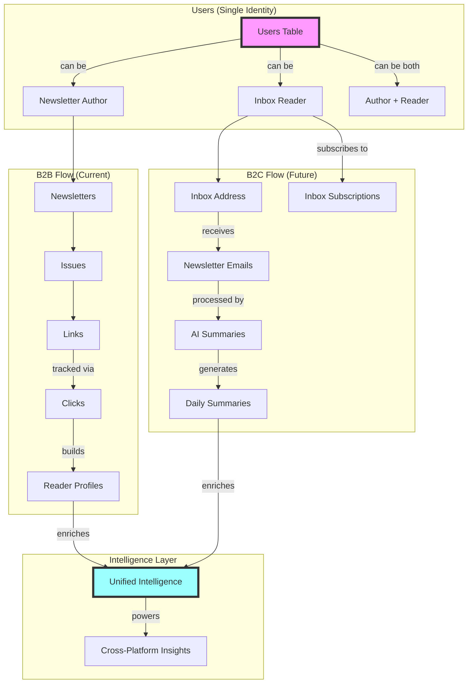
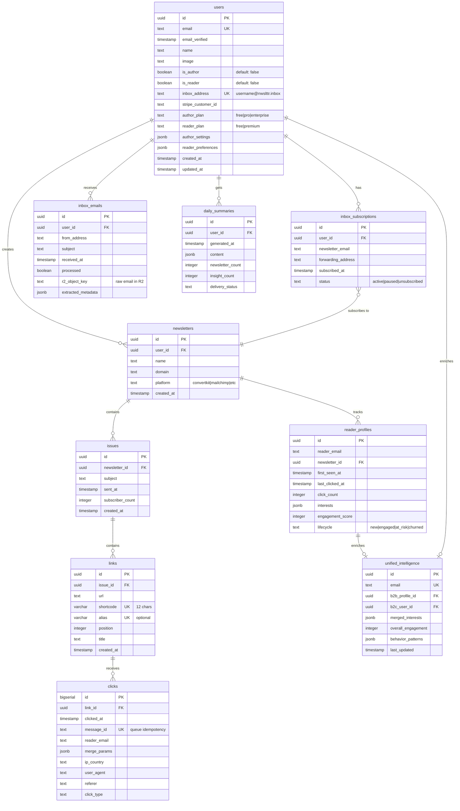
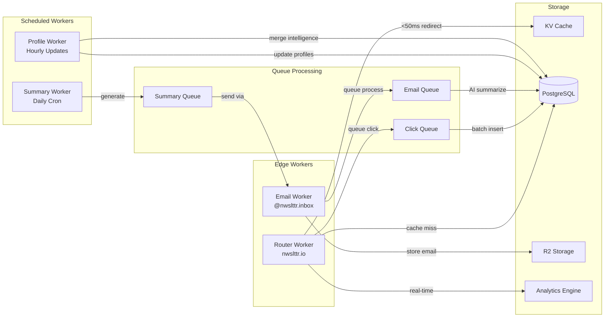
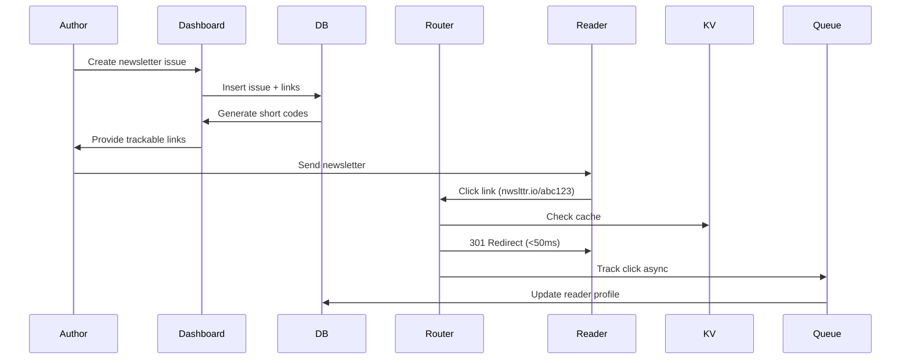
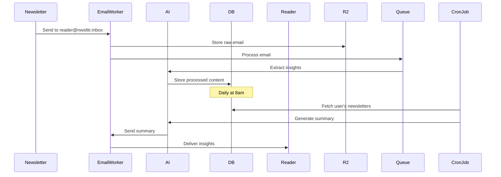

# nwslttr.io Marketplace Architecture

## System Overview



## Database Schema



## Worker Architecture



## Data Flow Examples

### B2B: Author Creates Newsletter → Reader Clicks



### B2C: Reader Receives Daily Summary



### Unified Intelligence Flow

```mermaid
graph TD
    subgraph "Data Sources"
        B2B[B2B Click Data<br/>Who clicked what]
        B2C[B2C Reading Data<br/>What they subscribe to]
    end

    subgraph "Intelligence Processing"
        Merge[Merge Profiles<br/>Same email = same person]
        Enrich[Enrich Patterns<br/>Reading + Creating behavior]
        Score[Score Engagement<br/>Unified metric]
    end

    subgraph "Value Creation"
        AuthorInsight[Author gets:<br/>"Your React readers also read AI Weekly"]
        ReaderRec[Reader gets:<br/>"You might like this newsletter"]
        Platform[Platform gets:<br/>Complete market intelligence]
    end

    B2B --> Merge
    B2C --> Merge
    Merge --> Enrich
    Enrich --> Score
    Score --> AuthorInsight
    Score --> ReaderRec
    Score --> Platform
```

## Key Design Decisions

1. **Single User Table**: One identity can be author, reader, or both
2. **Separate Tracking**: B2B tracks via links, B2C tracks via email forwarding  
3. **Unified Intelligence**: Merge data from both sides for network effects
4. **Edge Performance**: Redirects stay <50ms, everything else is async
5. **Privacy First**: Separate reader_email from user PII